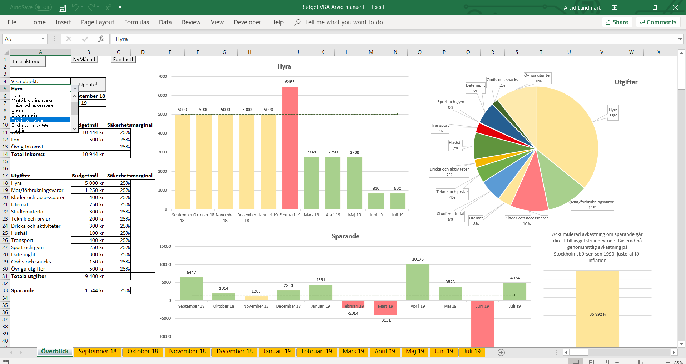

Welcome to my household budget!

This is a household budget created in Excel and Visual Basic for Applications. 

1. See the Budget_example for an overview how the project looks like.
2. Open up Budget_empty file, scroll down and use the START!-button at desired month. 
3. Further instructions can be found inside the file. 

Enjoy!

The data used in the example file was gathered by Nils, based on real usage from September 2018 to July 2019. 

Created by Arvid Landmark, September 2018. 

Preview:

