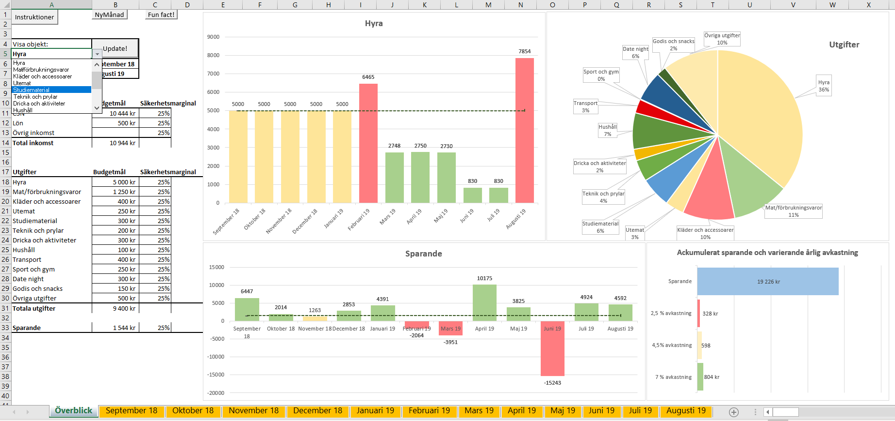
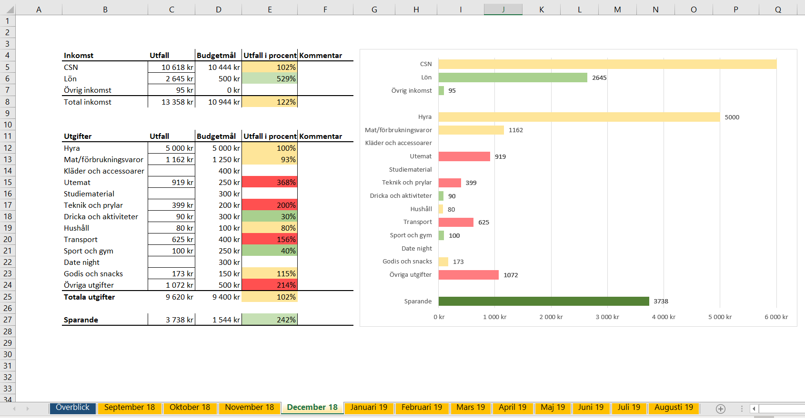

Welcome to my household budget!

This is a household budget created in Excel and Visual Basic. 

Look through the Budget_example for an overview how the project looks like.
To get going; open up Budget_empty file and scroll down to use the START!-button at desired month. Choose what categories you would like to use and enter your expenses accordingly.

Further instructions can be found inside the file. 

Enjoy!

The data used in the example file was gathered by my friend Nils, based on real usage from September 2018 to July 2019. 

Created by Arvid Landmark, September 2018. 

Overview:

Monthly view:

